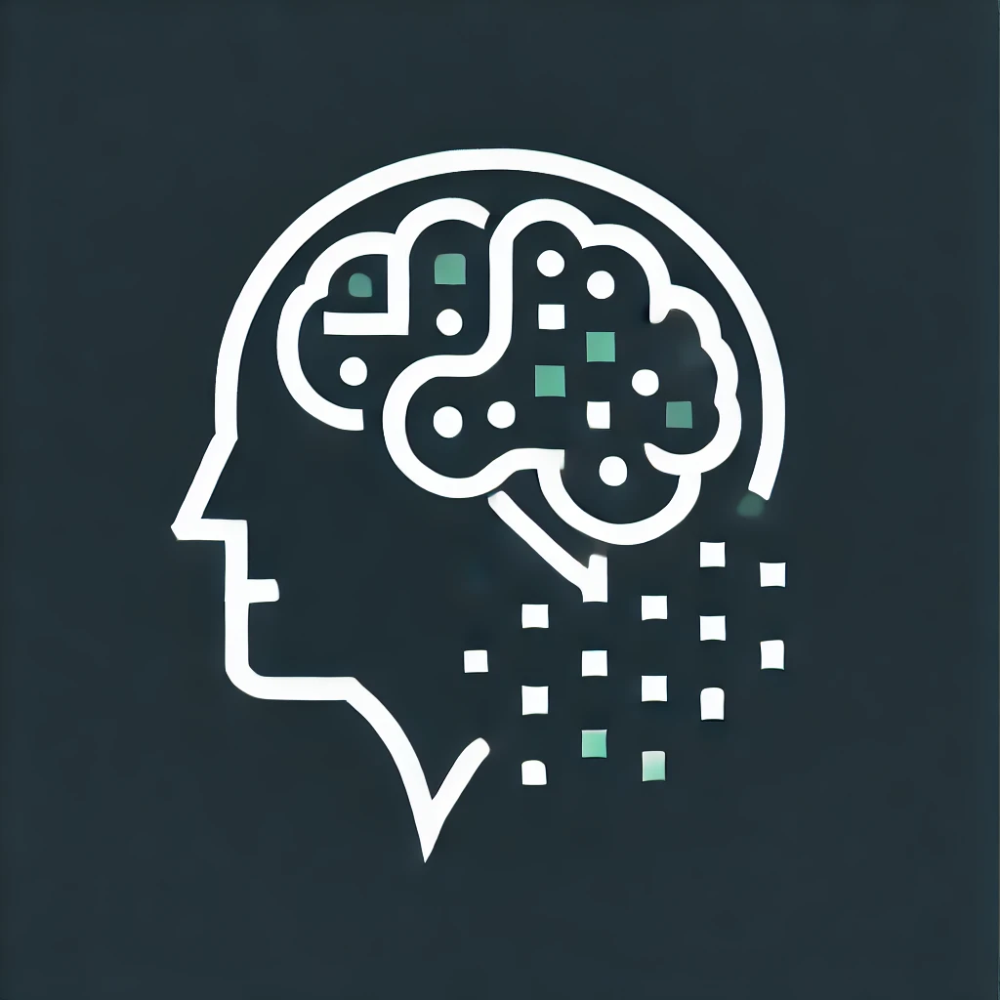

# 🔬 Medical Image Analytics

## Overview

Medical Image Analytics is a cutting-edge web application designed to assist individuals in identifying medical images using the power of Large Language Models (LLMs) like Gemini. By leveraging advanced AI technology, this app aims to make the detection and identification of diseases easier, providing quick insights and recommendations based on uploaded medical images.

## Table of Contents

- [Introduction](#introduction)
- [Features](#features)
- [How It Works](#how-it-works)
- [Installation](#installation)
- [Usage](#usage)
- [Future Plans](#future-plans)
- [Contributing](#contributing)
- [License](#license)

## Introduction

The identification of diseases through medical imaging is a critical task in healthcare. However, it can be time-consuming and requires specialized expertise. With the advent of LLMs like Gemini, we can automate and streamline this process, making it accessible to a wider audience. This application aims to empower individuals by providing a tool that can analyze medical images, highlight notable features, and suggest possible medical conditions.

## Features

- **Upload and Analyze Medical Images**: Users can upload medical images (e.g., X-rays, MRIs, CT scans) for analysis.
- **Identify Imaging Types**: The app identifies the type of medical imaging used.
- **Anatomical Structure Description**: Provides a description of visible anatomical structures.
- **Highlight Abnormalities**: Highlights any notable features such as fractures or lesions.
- **Medical Condition Suggestions**: Suggests possible medical conditions based on the analysis.
- **Recommendations for Further Tests**: Recommends further tests or examinations based on the findings.

## How It Works

1. **Image Upload**: Users upload a medical image via the web interface.
2. **Image Processing**: The image is processed and analyzed using the Gemini LLM.
3. **Result Generation**: The model generates a detailed analysis report, including identification of the imaging type, description of anatomical structures, abnormalities, possible medical conditions, and further test recommendations.
4. **Display Results**: The results are displayed on the web interface for the user to review.

